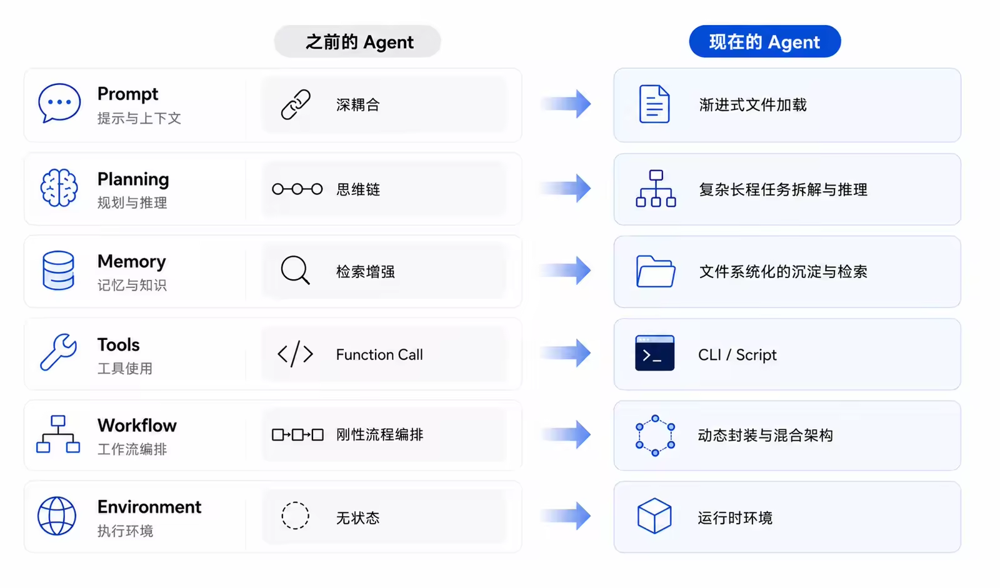

Prompt：早期 Agent 采用“一任务一 Agent”，每个 Agent 都依赖包含人设、目标、约束和示例的庞大独立 Prompt，导致重复编写、维护成本高、管理混乱。
如今的演进方向是实现 Prompt 的“动静分离”：
System Prompt：只保留稳定、通用的系统指令、行为规范和工具使用方式。
Skill 文件：用 SKILL.md 等文件沉淀具体任务的方法、流程和领域约束。
配置文件：用 USER.md、SOUL.md、CLAUDE.md、AGENTS.md 等管理人设、用户偏好和通用规则。
渐进式披露：Agent 根据当前任务，按需读取相关文件，避免一次加载全部上下文。
本质上，这不是简单地减少 Prompt，而是重构上下文的组织方式：从“单体大 Prompt”转向“稳定 System Prompt + 模块化外部文件 + 按需加载”，从而降低维护成本，提升复用性、可组合性和场景适应能力。

Planning：早期 Agent 的 Planning 主要依赖思维链和“逐步思考”类提示词，以线性方式完成推理。受限于当时基础模型的能力，它只适合简单任务，处理复杂问题时容易出现逻辑断层或死循环。
随着基座模型推理能力增强，Planning 已实现三方面升级：
将模糊目标结构化拆解为可执行的子任务和 Todo List。
按计划完成多步、长周期任务，并根据执行结果动态调整。
根据子任务需要动态调用子 Agent，实现分工协作。
其本质是：Planning 已从简单的 Prompt 技巧，演变为 Agent 的智能决策中枢。这一变化的核心驱动力并非架构概念本身，而是底层模型在逻辑推理、长文本理解和复杂指令遵循方面的整体升级。

Memory：Agent Memory 正从“简单存储与纯向量检索”转向更精细的混合管理。
短期记忆：重点从保存对话转向压缩上下文。通过阈值触发、结构化摘要和重点提取，减少噪音与 Token 消耗，同时保留关键指令、事实和结论。
长期事项记忆：使用 MEMORY.md、每日记忆日志等 Markdown 文件记录用户偏好、历史行为和状态变化，更可控、易读且便于追踪。
长期知识记忆：个人知识库逐渐采用本地文件系统与 Obsidian 等工具；面对大规模企业知识，则需结合 QMD、SQLite、向量数据库等检索能力。
核心趋势是“文件系统沉淀 + 向量检索”的混合模式：既利用目录、标签和链接提升可读性与可解释性，也保留语义检索处理海量知识的能力，在记忆效果、效率和成本之间取得平衡。

Tools：Agent 工具调用正从 Function Call 转向 CLI + Script。

早期 Function Call 需要把每项能力封装成 API，并维护大量 Schema；MCP 改善了工具注册和发现，却没有改变接口调用的本质。新的范式则更充分地利用模型已有的计算机知识：

- CLI：模型天然熟悉常见命令；遇到陌生工具，也能通过 `--help` 按需学习，减少 API 开发、Schema 管理和 Token 成本。
- Skill：为第三方 CLI 提供安装说明、操作规范和示例，实现新工具的快速接入。
- Script：将本地操作、远程 API、鉴权和参数拼装封装成可执行脚本，Agent 只需选择脚本并传入核心参数。

其本质是从“人为给每项操作开发模型专用接口”，转向“让模型运用原生的 CLI 理解与代码执行能力”，从而形成更轻量、灵活、可扩展的工具生态。

Workflow：Agent 的流程控制正从刚性 Workflow 转向以 Skill 为主的混合架构。

早期模型能力有限，需要用状态机式 Workflow 固定执行顺序，以防任务跑偏，但这种方式机械、缺乏环境适应能力。随着模型与 Agent Skills 的发展，流程开始重构：

- 逻辑内聚：将步骤、约束和判断规则写入 `SKILL.md`，由 Agent 理解并动态执行。
- 执行脚本化：把需要精确控制的环节封装为 Script，使复杂流程成为可复用的 Skill。

不过，Skill 自主性更强，也可能产生理解偏差；传统 Workflow 虽笨重，却能提供确定性。因此，企业实践通常采用混合方案：

- 成熟、标准化且需要灵活组合的任务封装为 Skill。
- 高风险、低容错的主干流程保留 Workflow。
- 必要时将 Workflow 封装为 Tool，供 Agent 按需调用。

核心原则是：**Skill 为主，Workflow 为辅或兜底**，在开发效率、灵活性和运行稳定性之间取得平衡。

Environment： 随着 Agent 从无状态的问答工具升级为能够操作文件、执行代码和管理状态的“数字员工”，专属 Workspace 与持久化 Runtime 已成为基础设施，用于保存配置、日志、中间文件、Skill 和 Memory。

Runtime 主要有两种形态：

- 本地电脑：可直接操作用户文件、应用和网络，灵活便利，适合个人自动化；但风险较高，需要权限控制和关键操作确认。
- 沙箱或云服务器：通过 Docker、Kubernetes 等技术隔离文件系统、权限和资源，即使 Agent 误操作，也不会影响宿主机，适合企业生产环境。

核心变化是：Agent 不再只是调用模型和工具，而是需要一个具备持久化能力、权限边界与安全隔离的完整运行环境。
