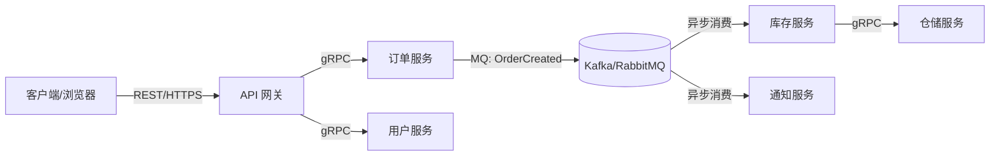

① 限流  →  ② 认证  →  ③ 追踪  →  转发后端

成本：低        中        低
目的：保护      安全      可观测

┌─────────────────────────────────────────────────────────┐
│  客户端发出的原始请求                                      │
│                                                         │
│  GET /api/orders/456 HTTP/1.1                           │
│  Authorization: api.myapp.com                                    │
│  Authorization: Bearer eyJhbG...(JWT)                   │
│  Cookie: sessionId=xxx; theme=dark                      │
│  X-Forwarded-For: 58.66.12.33 (客户端真实IP)             │
└────────────────────────┬────────────────────────────────┘
                         │
                         ▼
┌─────────────────────────────────────────────────────────┐
│  API 网关处理引擎                                        │
│                                                         │
│  ① 限流：令牌桶检查通过                                   │
│  ② 认证：解析 JWT，提取 sub=123, role=admin              │
│  ③ 追踪：生成 x-trace-id=trace-abc-123                  │
│  ④ 安全剥离：                                            │
│     - 删除 Authorization (JWT已解析，不再往下传)          │
│     - 删除所有 X-Internal-* 头 (防外部伪造内部特权)       │
│  ⑤ 注入：                                               │
│     - 加上 X-User-Id: 123                               │
│     - 加上 X-User-Role: admin                           │
│     - 加上 X-Trace-Id: trace-abc-123                    │
│  ⑥ 路由匹配：/api/orders → 订单服务 (10.0.0.5:8082)     │
└────────────────────────┬────────────────────────────────┘
                         │
                         ▼
┌─────────────────────────────────────────────────────────┐
│  网关转发给后端【订单服务】的最终请求                       │
│                                                         │
│  GET /api/orders/456 HTTP/1.1                           │
│  Host: 10.0.0.5:8082           ← 网关改写了目标Host      │
│  X-User-Id: 123                ← 网关注入的身份信息      │
│  X-User-Role: admin            ← 网关注入的身份信息      │
│  X-Trace-Id: trace-abc-123     ← 网关注入的追踪ID       │
│  X-Forwarded-For: 58.66.12.33  ← 透传的真实客户端IP     │
│  Cookie: sessionId=xxx; theme=dark ← 原样透传的Cookie   │
│                                                         │
│  (注意：Authorization 头不见了！X-Internal-* 头也不见了!)│
└─────────────────────────────────────────────────────────┘

浏览器 Network 只能看到 浏览器 ↔ 网关/服务器 之间的通信。网关注入的 Header 发生在 网关 ↔ 后端服务 的内部转发阶段，浏览器根本接触不到，自然看不到。

BFF 聚合层如何通过"并行 + 串行"的编排策略，高效地从多个微服务获取数据并组装返回给前端

通信：
RPC (gRPC)、REST 和消息队列是构建分布式系统的三大核心通信范式。它们并非互相替代的关系，而是分别解决了**同步调用**、**通用交互**和**异步解耦**这三类截然不同的问题。

简单来说：
-   **REST** 是面向资源的通用语言，适合对外暴露 API。
-   **gRPC** 是面向动作的高性能契约，适合内部微服务间紧密协作。
-   **消息队列** 是面向事件的异步管道，适合削峰填谷与系统解耦。

以下是三者的深度解析与选型指南。

### ⚙️ 核心定义与设计哲学

#### REST：以“资源”为中心的通用协议
-   **本质**：基于 HTTP/1.1（或 HTTP/2）的架构风格，将一切抽象为“资源”，通过标准动词操作。
-   **核心约束**：无状态、统一接口、客户端-服务器分离。
-   **数据格式**：通常为 JSON（文本），人类可读但机器解析开销大。
-   **定位**：互联网事实标准，浏览器原生支持，生态最成熟。

#### gRPC：以“服务”为中心的高性能 RPC
-   **本质**：基于 HTTP/2 + Protobuf 的远程过程调用框架，让跨网络调用像本地函数一样自然。
-   **核心特性**：强类型契约、二进制序列化、多路复用、双向流。
-   **数据格式**：Protobuf（二进制），体积小、解析快，但不可直接阅读。
-   **定位**：云原生时代微服务内部通信首选，性能远超 REST。

#### 消息队列：以“事件”为中心的异步中间件
-   **本质**：生产者-消费者模型的消息传递系统，发送方与接收方完全解耦。
-   **核心能力**：异步投递、缓冲削峰、广播/点对点路由、持久化与重放。
-   **数据格式**：任意（JSON/Protobuf/Avro 等），由业务自定义。
-   **定位**：系统间的“减震器”与“连接器”，处理非实时、高吞吐、可靠性要求高的场景。

### 📊 关键维度对比

| 维度 | REST | gRPC | 消息队列 |
| :--- | :--- | :--- | :--- |
| **通信模式** | 同步请求-响应 | 同步 Unary / 异步 Stream | 异步发布-订阅 / 点对点 |
| **耦合度** | 中等（依赖 URL+方法） | 高（依赖 .proto 契约） | 极低（仅依赖消息格式） |
| **性能** | ★★☆☆☆ (文本+HTTP/1.1) | ★★★★★ (二进制+HTTP/2) | ★★★★☆ (异步批量) |
| **浏览器支持** | ✅ 原生 | ⚠️ 需 grpc-web 代理 | ❌ 不支持 |
| **调试友好性** | ✅ curl/Postman 直接用 | ⚠️ 需专用工具 | ⚠️ 需控制台/CLI |
| **错误处理** | HTTP 状态码（语义有限） | 丰富 Status Code + Metadata | 重试/死信/ACK 机制 |
| **典型延迟** | 毫秒~百毫秒级 | 亚毫秒~毫秒级 | 毫秒~秒级（取决于消费速度） |

### 🎯 选型决策框架

选择哪种技术，取决于你要解决的核心问题：

#### 选 REST，当...
-   面向外部用户、第三方开发者或浏览器；
-   资源模型清晰，CRUD 操作为主；
-   团队熟悉度高，需快速交付；
-   需要利用 CDN、缓存、网关等 HTTP 生态。

> **避坑**：不要为了“现代感”在内部服务间强行用 REST。当调用频次 > 1000 QPS 或 Payload > 10KB 时，REST 的性能瓶颈会显著显现。

#### 选 gRPC，当...
-   微服务内部高频、低延迟调用；
-   需要强类型契约保障多语言互操作性；
-   涉及流式传输（实时推送、大文件上传、AI 推理）；
-   团队已建立 Protobuf 治理规范。

> **避坑**：不要用 gRPC 做对外公开 API。浏览器兼容性差、调试困难、错误码对前端不友好，且缺乏 HTTP 缓存语义。

#### 选消息队列，当...
-   调用方与被调方无需实时等待结果；
-   流量突发，需缓冲防止下游崩溃；
-   一个事件需触发多个异构系统响应；
-   需要保证消息不丢失、可重试、可追溯；
-   数据管道、ETL、日志采集等批处理场景。

> **避坑**：不要用 MQ 做同步请求-响应。虽然可实现，但复杂度高、延迟不可控，违背了 MQ 的设计初衷。同步交互请用 gRPC/REST。

### 🔗 三者如何协同工作？

在成熟的分布式架构中，三者常分层组合：

-   **南北向（外→内）**：REST 提供兼容性与安全性；
-   **东西向（内→内）**：gRPC 保障高性能与类型安全；
-   **异步链路**：MQ 实现最终一致性与弹性容错。

### 📌 总结

-   **REST 是“门面”**：通用、易用、生态广，但不适合高强度内部通信。
-   **gRPC 是“血管”**：高效、精准、强契约，但对外不友好。
-   **消息队列是“神经系统”**：解耦、缓冲、可靠，但不适合实时交互。

没有最好的技术，只有最合适的组合。**先明确你的通信模式（同步/异步）、受众（内部/外部）和性能要求，再匹配对应范式**。盲目追求单一技术全覆盖，是分布式系统设计中最常见的反模式。